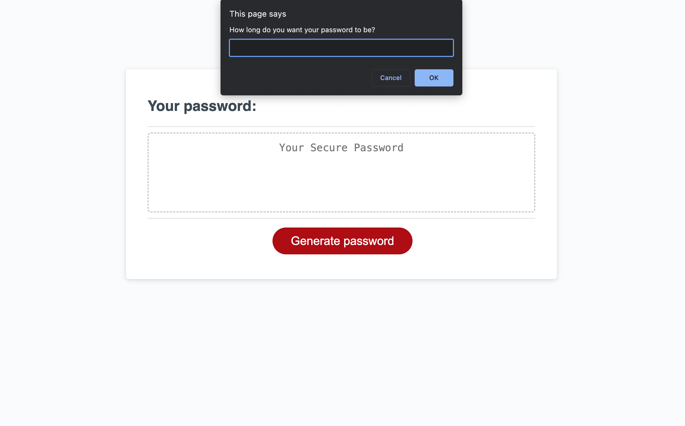

# Password-Generator

## Description
This application was made to help users creating a new password that is randomly generated. 
The user can choose to include different character types and if to include them all, a combination of some of them or just one of them.

The minimum and maximum length of the password is defined and the user is made aware of this when prompted to choose how long the password should be.

While working on this application, I learned about a bunch of new things. The **null** value, how to use a **while loop** to run the code until the condtion set is met when I don't know how many times the code should run. The **confirm function** which shows a modal window with a question and two buttons: OK and Cancel; the result is true if OK is pressed and false otherwise. The **concat method** to join two or more strings. I also found a function to generate a random value from an array using the static methods **Math.floor** and **Math.random**.

## Installation 
N/A

## Usage
To use this application, navigate to [Password-Generator](https://naike-b.github.io/Password-Generator/) .

⬇️

From here, click on the red button **Generate password**.

⬇️

You'll be presented with a series of prompts to choose the password's criteria:
- Length: between 8 and 128 characters
- Lower case characters (OK = Yes, Cancel = No)
- Upper case characters (OK = Yes, Cancel = No)
- Numbers (OK = Yes, Cancel = No)
- Special characters (OK = Yes, Cancel = No)

⬇️

The password is randomly generated and displayed in the white box under **Your Password:**

This is what the application looks like:

## Credits
I used the following resources:

- [Javascript prompt() - cancel button to terminate the function](https://stackoverflow.com/questions/12864582/javascript-prompt-cancel-button-to-terminate-the-function)

- [JavaScript.info - Interaction: alert,prompt,confirm](https://javascript.info/alert-prompt-confirm)

- [W3 School - JavaScript String concat()](https://www.w3schools.com/jsref/jsref_concat_string.asp)

- [Stack overflow - Getting a random value from a JavaScript array](https://stackoverflow.com/questions/4550505/getting-a-random-value-from-a-javascript-array)

## License
Please refer to the LICENSE in the repository (MIT license).